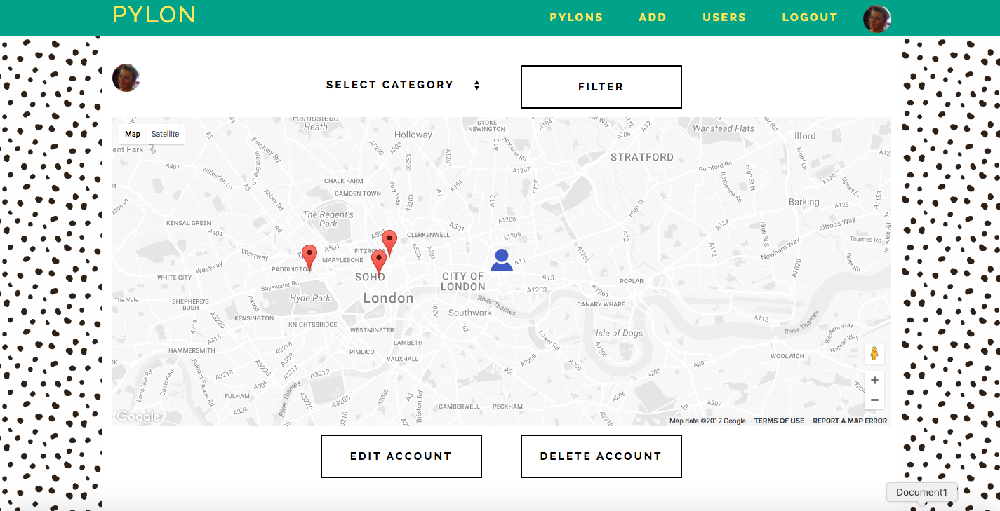
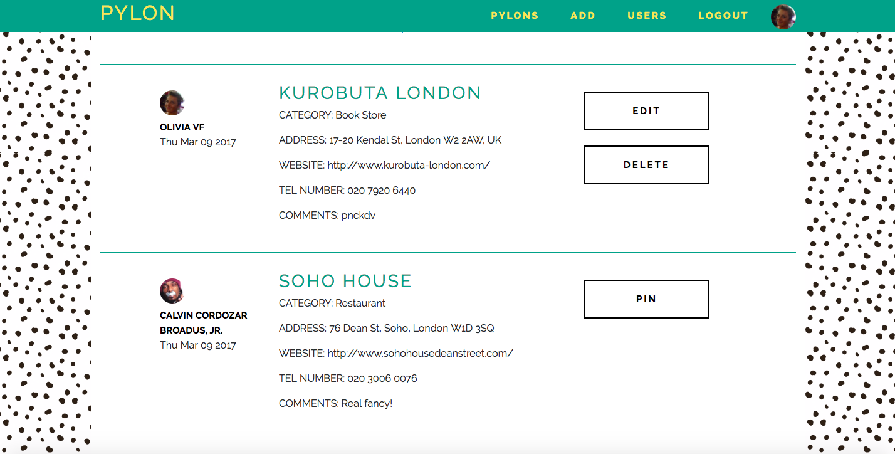
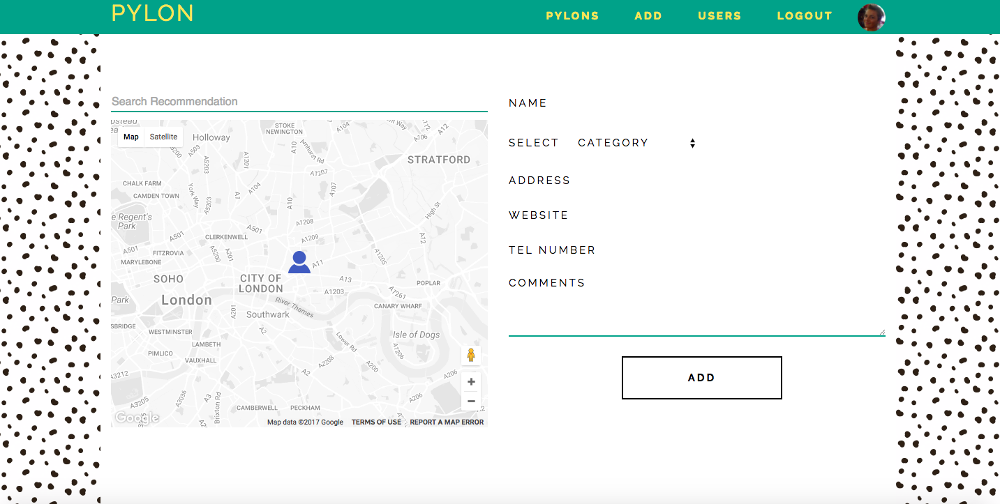

# Pylon

##GA WDI London - Project 2

#####[View it here!](https://pure-atoll-74725.herokuapp.com/)

#####About

Pylon is a fully restful applicaiton. It is a platform, pivoting on map functionality, for users to easily store and share recommendations.

#####How it Works

Once registered and logged in, users are directed to their profile page: a map with markers representing their stored recommendations. They can click on each one and see a modal of that recommendation's information (name, address, website, telephone number, and comments). The map shows them their location, and they can filter the markers on their map by category. 

Users can add new recommendations, and when doing so these are also shared on the Pylons feed for other users to see. From here other users can pin these recommendations to their own map. 

#####Build

* HTML 5, SASS, jQuery, AJAX, Express, Node.js, and Google Maps API were used to create this application.
* The font 'Raleway' was used across all pages.

#####Problems & Challenges

My main challenge was grabbing the right data from the Google Maps API and manipulating it in the way I wanted. I ended up presenting forms of this data as modals, which was quite difficult. 

